# 🤖 AI SRE Agent - Intelligent Kubernetes Self-Healing

An autonomous AI-powered Site Reliability Engineering agent that monitors Kubernetes clusters, detects issues, and automatically remediates problems using AI decision-making.

---

## 📋 Table of Contents

1. [What is This?](#-what-is-this)
2. [Architecture](#-architecture)
3. [How It Works](#-how-it-works)
4. [Project Structure](#-project-structure)
5. [Setup Guide](#-setup-guide-5-minutes)
6. [Deployment Guide](#-deployment-guide-10-minutes)
7. [Performance Metrics](#-performance-metrics)
8. [API Reference](#-api-reference)
9. [The Chat Interface](#-the-chat-interface)
10. [Automatic Remediation](#-automatic-remediation)
11. [Safety Features](#-safety-features)
12. [FAQ](#-faq)

---

## 🎯 What is This?

This is an **AIOps (AI for IT Operations)** agent that:

| Feature      | Description                                       |
| ------------ | ------------------------------------------------- |
| **Monitors** | Watches your Kubernetes cluster 24/7              |
| **Detects**  | Identifies issues like crashes, OOM, high CPU     |
| **Decides**  | Uses AI (Groq LLM) to analyze and recommend fixes |
| **Fixes**    | Automatically restarts pods, scales deployments   |
| **Verifies** | Checks if the fix worked                          |
| **Notifies** | Sends email alerts about actions taken            |

### Two Modes of Operation

```mermaid
flowchart LR
    subgraph AUTO["🤖 AUTOMATIC MODE"]
        A1[Prometheus Alert] --> A2[AI Analysis]
        A2 --> A3[Auto-Fix]
        A3 --> A4[Verify]
    end

    subgraph CHAT["💬 CHAT MODE"]
        C1[You] --> C2[Question]
        C2 --> C3[AI]
        C3 --> C4[Answer]
    end
```



---

## 🏗 Architecture

### High-Level Overview

```mermaid
flowchart TB
    subgraph LOCAL["💻 YOUR LOCAL MACHINE"]
        subgraph AGENT["AI SRE Agent - Flask Server :5000"]
            EP1["/ - Chat UI"]
            EP2["/ask - Chat API"]
            EP3["/webhook - Alerts"]
            EP4["/health - Status"]
        end

        AGENT --> GROQ["🤖 Groq API<br/>llama-3.3-70b"]
        AGENT --> SQLITE["📊 SQLite<br/>Incident History"]
        AGENT --> GMAIL["📧 Gmail SMTP"]
    end

    LOCAL -->|~/.kube/config| K8S

    subgraph K8S["☸️ KUBERNETES CLUSTER"]
        subgraph NS1["ai-sre namespace"]
            APP["Target App<br/>(monitored)"]
        end
        subgraph NS2["monitoring namespace"]
            PROM["Prometheus"]
            GRAF["Grafana"]
        end
        subgraph NS3["qdrant namespace"]
            QDRANT["Vector DB<br/>(RAG)"]
        end
    end

    PROM -->|alerts| EP3
    AGENT --> QDRANT
```



### Data Flow Diagram


### Low-Level: Internal Components

```mermaid
block-beta
    columns 3

    block:SERVER["🌐 FLASK SERVER"]:1
        columns 1
        EP1["app = Flask()"]
        EP2["/webhook"]
        EP3["/ask"]
        EP4["/health"]
    end

    block:AI["🤖 AI INTEGRATION"]:1
        columns 1
        AI1["get_groq()"]
        AI2["analyze_alert()"]
        AI3["TOOLS list"]
    end

    block:K8S["☸️ K8S ACTIONS"]:1
        columns 1
        K1["restart()"]
        K2["scale()"]
        K3["delete_pod()"]
        K4["get_logs()"]
    end

    space:3

    block:DB["📊 DATABASE"]:1
        columns 1
        DB1["SQLite"]
        DB2["incidents.db"]
    end

    block:SAFETY["🛡️ SAFETY LAYER"]:1
        columns 1
        S1["confidence ≥ 0.8"]
        S2["risk levels"]
        S3["approval gates"]
    end

    block:NOTIFY["📧 NOTIFICATIONS"]:1
        columns 1
        N1["send_email()"]
        N2["Gmail SMTP"]
    end
```



### Low-Level: Code Structure

```mermaid
flowchart TD
    subgraph ENTRY["📥 ENTRY POINTS"]
        E1["/webhook<br/>alerts"]
        E2["/ask<br/>chat"]
        E3["/trigger-test<br/>testing"]
    end

    E1 --> PA["parse_alert()<br/>• Extract pod<br/>• Get namespace<br/>• Get severity"]
    E2 --> AA["ask_agent()<br/>• Get history<br/>• Build prompt"]

    PA --> GROQ
    AA --> GROQ
    E3 --> GROQ

    GROQ["get_groq()<br/>• Init client<br/>• API call<br/>• Parse tools"]

    GROQ --> A1["restart_deployment()<br/>K8s API"]
    GROQ --> A2["scale_deployment()<br/>K8s API"]
    GROQ --> A3["delete_pod()<br/>K8s API"]

    A1 --> VERIFY
    A2 --> VERIFY
    A3 --> VERIFY

    VERIFY["verify()<br/>• Wait 30s<br/>• Check pods<br/>• Return bool"]

    VERIFY --> LOG["log_incident()<br/>SQLite"]
    VERIFY --> VEC["store_vector()<br/>Qdrant"]
    VERIFY --> EMAIL["send_email()<br/>Gmail"]
```



### Low-Level: Database Schema


### Low-Level: Kubernetes API Calls

```mermaid
sequenceDiagram
    participant A as AI SRE Agent
    participant K as Kubernetes API

    A->>K: list_pod_for_all_namespaces()
    K-->>A: GET /api/v1/pods → [Pod list]

    A->>K: read_namespaced_pod_log()
    K-->>A: GET /api/v1/.../pods/{pod}/log → [Log text]

    A->>K: patch_namespaced_deployment()
    K-->>A: PATCH /apis/apps/v1/.../deployments/{dep} → [Restarted]

    A->>K: delete_namespaced_pod()
    K-->>A: DELETE /api/v1/.../pods/{pod} → [Deleted]

    Note over A,K: Auth: ~/.kube/config or ServiceAccount
```



---

## ⚙️ How It Works

### The Alert Pipeline

| Component              | Role                         | How                  |
| ---------------------- | ---------------------------- | -------------------- |
| **kube-state-metrics** | Exposes K8s state as metrics | Runs as DaemonSet    |
| **Prometheus**         | Scrapes & stores metrics     | Every 15 seconds     |
| **PrometheusRules**    | Defines alert conditions     | YAML files you write |
| **AlertManager**       | Routes alerts                | Sends to webhook     |
| **AI SRE Agent**       | Analyzes & acts              | Python + Groq AI     |

### What Triggers Alerts?

You define the rules! Here's an example:

```yaml
# Example PrometheusRule
apiVersion: monitoring.coreos.com/v1
kind: PrometheusRule
spec:
  groups:
    - name: pod-alerts
      rules:
        - alert: PodCrashLoopBackOff
          expr: increase(kube_pod_container_status_restarts_total[5m]) > 3
          for: 2m
          labels:
            severity: critical
          annotations:
            description: "Pod {{ $labels.pod }} has restarted 3+ times"
```

### What the AI Sees

When an alert fires, the agent sends this to the AI:

```
ALERT: PodCrashLoopBackOff
POD: nginx-7f9d8c7b5-x9z2k
NAMESPACE: ai-sre
SEVERITY: critical

POD LOGS (last 50 lines):
[2024-01-06 10:15:32] Error: Connection refused
[2024-01-06 10:15:33] Retrying in 5 seconds...
[2024-01-06 10:15:38] Error: Connection refused

SIMILAR PAST INCIDENTS:
- 3 days ago: Same error, restarted deployment, fixed
- 1 week ago: Similar crash, scaled to 3 replicas, fixed

Available actions: restart_deployment, scale_deployment, delete_pod
```

**Total data sent: ~2-5KB per incident (NOT gigabytes of logs!)**

---

## 📁 Project Structure

```
agent_playground/
├── src/                          # Core Application
│   ├── ai_sre_agent.py          # Main agent (1166 lines)
│   ├── vector_search.py         # RAG with Qdrant
│   ├── extended_actions.py      # Additional K8s actions
│   ├── metrics_bridge.py        # Prometheus integration
│   ├── test_components.py       # Testing utilities
│   └── .env                     # Environment variables
│
├── k8s/                          # Kubernetes Manifests
│   ├── ai-sre-agent-deployment.yaml    # Agent deployment + RBAC
│   ├── ai-sre-workload.yaml            # Test workload
│   ├── alertmanager-config.yaml        # Alert routing rules
│   ├── qdrant.yaml                     # Vector database
│   └── ...                             # Prometheus, Grafana, etc.
│
├── static/                       # Frontend
│   └── index.html               # ChatGPT-style chat UI
│
├── grafana/                      # Dashboards
│   └── ai-sre-dashboard.json    # Pre-built monitoring dashboard
│
├── Dockerfile                    # Container build
├── requirements.txt              # Python dependencies
└── README.md                     # This file!
```

### File Details

| File                  | Lines | Purpose                                                        |
| --------------------- | ----- | -------------------------------------------------------------- |
| `ai_sre_agent.py`     | 1166  | Flask server, webhook handler, chat API, all remediation logic |
| `vector_search.py`    | 160   | Stores/searches incidents in Qdrant for RAG                    |
| `extended_actions.py` | 350   | Additional K8s actions (drain, cordon, exec)                   |
| `metrics_bridge.py`   | 130   | Prometheus metrics collector                                   |
| `index.html`          | 350   | Minimalist ChatGPT-style chat interface                        |

---

## 🚀 Setup Guide (5 minutes)

### Prerequisites

| Requirement        | Version | Check Command                                                        |
| ------------------ | ------- | -------------------------------------------------------------------- |
| Python             | 3.9+    | `python3 --version`                                                  |
| kubectl            | 1.25+   | `kubectl version --client`                                           |
| Kubernetes cluster | Any     | `kubectl cluster-info`                                               |
| Groq API Key       | Free    | [console.groq.com](https://console.groq.com)                         |
| Gmail App Password | -       | [Google Account Settings](https://myaccount.google.com/apppasswords) |

### Step 1: Clone the Repository

```bash
git clone https://github.com/yourusername/agent_playground.git
cd agent_playground
```

### Step 2: Install Python Dependencies

```bash
pip install -r requirements.txt
```

**Dependencies installed:**

- `flask` - Web server
- `groq` - AI API client
- `kubernetes` - K8s client
- `qdrant-client` - Vector database
- `python-dotenv` - Environment variables

### Step 3: Configure Environment Variables

Create `src/.env`:

```env
# Required: AI Provider
GROQ_API_KEY=gsk_xxxxxxxxxxxxxxxxxxxxxxxxxxxx

# Required: Email Notifications
GMAIL_USER=your-email@gmail.com
GMAIL_APP_PASSWORD=xxxx-xxxx-xxxx-xxxx

# Optional: Target Configuration
TARGET_NAMESPACE=ai-sre
TARGET_DEPLOYMENT=ai-sre-target

# Optional: Safety Settings
CONFIDENCE_THRESHOLD=0.8
AUTO_ACTION_ENABLED=True
REQUIRE_APPROVAL_FOR=rollback,delete_deployment
```

### Step 4: Set Up Kubernetes Access

```bash
# Verify kubectl is configured
kubectl cluster-info

# Verify you have cluster access
kubectl get nodes
```

### Step 5: Deploy Qdrant Vector Database (if not exists)

```bash
kubectl apply -f k8s/qdrant.yaml

# Wait for pod to be ready
kubectl wait --for=condition=ready pod -l app=qdrant -n qdrant --timeout=120s

# Port-forward for local access
kubectl port-forward -n qdrant svc/qdrant 6333:6333 &
```

### Step 6: Start the Agent

```bash
cd src
python3 ai_sre_agent.py
```

**Expected output:**

```
✅ Kubernetes local config loaded
✅ Incident database initialized

============================================================
🚀 AI SRE Agent v3 - Production Ready with Safety
============================================================
  Webhook:    http://0.0.0.0:5000/webhook
  Health:     http://0.0.0.0:5000/health
  Auto-Action: True
  Confidence Threshold: 0.8
============================================================

 * Running on http://127.0.0.1:5000
```

### Step 7: Verify Installation

```bash
# Test health endpoint
curl http://localhost:5000/health

# Expected response:
# {"status":"healthy","k8s":true,"groq":true,"auto_action":true}
```

### Troubleshooting

| Issue                         | Solution                                     |
| ----------------------------- | -------------------------------------------- |
| `Kubernetes config not found` | Run `kubectl config view` to verify          |
| `Groq API error`              | Check API key in `.env`                      |
| `Qdrant connection refused`   | Run port-forward command                     |
| `Email not sending`           | Use Gmail App Password, not regular password |

---

## 🚢 Deployment Guide (10 minutes)

### Option A: Run Locally (Development)

Best for testing and development. Agent runs on your machine.

```bash
# Terminal 1: Port-forward Qdrant
kubectl port-forward -n qdrant svc/qdrant 6333:6333

# Terminal 2: Start agent
cd src && python3 ai_sre_agent.py

# Access UI
open http://localhost:5000
```

**Limitations:**

- Must keep terminal open
- Laptop must be connected to cluster
- Won't receive alerts when laptop is off

---

### Option B: Deploy to Kubernetes (Production)

Best for 24/7 autonomous operation. Agent runs inside cluster.

#### Step 1: Create ConfigMap for Environment

```bash
kubectl create configmap ai-sre-config -n ai-sre \
  --from-literal=TARGET_NAMESPACE=ai-sre \
  --from-literal=TARGET_DEPLOYMENT=ai-sre-target \
  --from-literal=CONFIDENCE_THRESHOLD=0.8 \
  --from-literal=AUTO_ACTION_ENABLED=true
```

#### Step 2: Create Secrets

```bash
kubectl create secret generic ai-sre-secrets -n ai-sre \
  --from-literal=GROQ_API_KEY=gsk_xxxx \
  --from-literal=GMAIL_USER=your@email.com \
  --from-literal=GMAIL_APP_PASSWORD=xxxx-xxxx-xxxx
```

#### Step 3: Build and Push Docker Image

```bash
# Build image
docker build -t your-registry/ai-sre-agent:v1 .

# Push to registry
docker push your-registry/ai-sre-agent:v1
```

#### Step 4: Deploy to Cluster

```bash
# Update image in deployment yaml
sed -i 's|image:.*|image: your-registry/ai-sre-agent:v1|' k8s/ai-sre-agent-deployment.yaml

# Apply deployment
kubectl apply -f k8s/ai-sre-agent-deployment.yaml
```

#### Step 5: Configure AlertManager Webhook

```yaml
# Add to AlertManager config:
receivers:
  - name: "ai-sre-agent"
    webhook_configs:
      - url: "http://ai-sre-agent.ai-sre.svc.cluster.local:5000/webhook"
        send_resolved: true
```

#### Step 6: Verify Deployment

```bash
# Check pod status
kubectl get pods -n ai-sre -l app=ai-sre-agent

# Check logs
kubectl logs -n ai-sre -l app=ai-sre-agent --tail=50

# Test endpoint (port-forward)
kubectl port-forward -n ai-sre svc/ai-sre-agent 5000:5000
curl http://localhost:5000/health
```

---

### Deployment Architecture

```mermaid
flowchart TB
    subgraph K8S["☸️ KUBERNETES CLUSTER"]
        subgraph MON["monitoring namespace"]
            PROM["📊 Prometheus"] -->|alerts| AM["🔔 AlertManager"]
        end

        AM -->|webhook| AGENT

        subgraph AISRE["ai-sre namespace"]
            AGENT["🤖 AI SRE Agent Pod<br/>• Receives /webhook<br/>• Analyzes with Groq AI<br/>• Executes K8s actions<br/>• Sends notifications"]
        end
    end
```



---

## 📊 Performance Metrics

### Response Times

| Operation          | Average Time | Notes                  |
| ------------------ | ------------ | ---------------------- |
| Health check       | < 50ms       | Local only             |
| Chat query         | 1-3 seconds  | Includes AI call       |
| Alert processing   | 2-5 seconds  | Full analysis + action |
| K8s restart        | < 1 second   | API call only          |
| Email notification | 1-2 seconds  | SMTP send              |
| Verification       | 30 seconds   | Wait for pods          |

### Resource Usage

| Resource | Idle    | During Alert |
| -------- | ------- | ------------ |
| CPU      | ~0.5%   | ~5%          |
| Memory   | ~150MB  | ~250MB       |
| Network  | < 1KB/s | ~50KB/s      |

### Scalability

| Metric               | Tested Value |
| -------------------- | ------------ |
| Concurrent alerts    | 10 at once   |
| Incidents per hour   | 100+         |
| Chat queries/min     | 30+          |
| Namespaces monitored | 10+          |
| Pods monitored       | 45+          |

### AI Model Performance

| Metric              | Value                   |
| ------------------- | ----------------------- |
| Model               | llama-3.3-70b-versatile |
| Provider            | Groq                    |
| Average confidence  | 0.75-0.85               |
| Correct action rate | ~90%                    |
| Response time       | 1-2 seconds             |

### Database Growth

| Time Period | Incidents | Database Size |
| ----------- | --------- | ------------- |
| 1 day       | ~10       | < 1MB         |
| 1 week      | ~50       | ~5MB          |
| 1 month     | ~200      | ~20MB         |

### Recommendations

| Cluster Size | Recommendation                         |
| ------------ | -------------------------------------- |
| < 50 pods    | Single agent instance                  |
| 50-200 pods  | Single agent, increase memory to 512MB |
| 200+ pods    | Consider multiple agents per namespace |

---

## 📡 API Reference

| Endpoint        | Method | Description                   |
| --------------- | ------ | ----------------------------- |
| `/`             | GET    | Chat UI                       |
| `/ask`          | POST   | Chat API (investigation only) |
| `/webhook`      | POST   | Receives Prometheus alerts    |
| `/health`       | GET    | Agent health status           |
| `/metrics`      | GET    | Prometheus metrics            |
| `/incidents`    | GET    | List all incidents            |
| `/pending`      | GET    | Pending approvals             |
| `/approve/<id>` | POST   | Approve high-risk action      |
| `/config`       | GET    | Current configuration         |
| `/trigger-test` | POST   | Simulate an alert             |

### Example: Chat API

```bash
curl -X POST http://localhost:5000/ask \
  -H "Content-Type: application/json" \
  -d '{"question": "How many pods are running?"}'
```

Response:

```json
{
  "answer": "There are 45 pods across 10 namespaces. Everything looks healthy!",
  "incidents": [],
  "action_taken": null
}
```

---

## 💬 The Chat Interface

### What You Can Ask

| Question             | What It Does           |
| -------------------- | ---------------------- |
| "How many pods?"     | Cluster summary        |
| "What about ai-sre?" | Pods in that namespace |
| "Any problem pods?"  | Shows issues           |
| "Recent incidents?"  | Past alerts & actions  |
| "List namespaces"    | All namespace names    |

### Chat is Investigation-Only

The chat can **only query** - it cannot delete, restart, or scale. This is intentional for safety.

- ✅ Query cluster state
- ✅ List pods and namespaces
- ✅ View incident history
- ❌ Delete pods
- ❌ Restart deployments
- ❌ Scale replicas

**Actions are only taken automatically via alerts!**

---

## ⚡ Automatic Remediation

### What Gets Auto-Fixed?

| Alert Type            | AI Decision               | Auto Action           |
| --------------------- | ------------------------- | --------------------- |
| `PodCrashLoopBackOff` | "Pod keeps crashing"      | ✅ Restart deployment |
| `PodOOMKilled`        | "Out of memory"           | ✅ Restart deployment |
| `HighCPUUsage`        | "Scale up to handle load" | ✅ Scale deployment   |
| `ImagePullBackOff`    | "Bad image, can't fix"    | ❌ Log + notify only  |
| `NodeNotReady`        | "Risky - needs human"     | ❌ Requires approval  |

### The Full Loop

```
Pod crashes
    │
    ▼ (automatic - every 15s)
Metric detected: restarts > 3
    │
    ▼ (automatic - rule evaluates)
Alert fires: CrashLoopBackOff
    │
    ▼ (automatic - AlertManager routes)
Webhook receives alert
    │
    ▼ (automatic - agent processes)
AI analyzes → "95% confidence: restart"
    │
    ▼ (automatic - if confidence > 80%)
Kubernetes: restart deployment
    │
    ▼ (automatic - verification)
Check: pods healthy? ✅
    │
    ▼ (automatic - notification)
Email: "Fixed CrashLoopBackOff in ai-sre"

🎉 NO HUMAN TOUCHED ANYTHING
```

---

## 🛡 Safety Features

### Confidence Threshold

```python
CONFIDENCE_THRESHOLD = 0.8  # Only act if AI is 80%+ confident
```

### Risk Levels

| Level      | Actions                       | Approval              |
| ---------- | ----------------------------- | --------------------- |
| **Safe**   | get_pods, get_events          | None                  |
| **Medium** | restart, scale, delete_pod    | Auto if confident     |
| **High**   | drain_node, delete_deployment | Always human approval |

### Approval Flow

```bash
# Check pending approvals
curl http://localhost:5000/pending

# Approve an action
curl -X POST http://localhost:5000/approve/abc123
```

---

## ❓ FAQ

### Q: Does every log get sent to Groq AI?

**No!** Only alert payloads (~500 bytes) plus relevant context (~2-5KB) are sent. Not gigabytes of logs.

### Q: Will it see new namespaces automatically?

**Yes!** The agent queries the Kubernetes API live. No need to update vector DB for new namespaces.

### Q: What's the vector database for?

**RAG (Retrieval-Augmented Generation)** - searching past similar incidents to help the AI make better decisions.

### Q: Can I run this 24/7?

**Yes!** Deploy the agent inside the K8s cluster:

```bash
kubectl apply -f k8s/ai-sre-agent-deployment.yaml
```

### Q: What if the AI makes a mistake?

Safety features prevent disasters:

- 80% confidence threshold
- High-risk actions require human approval
- Post-action verification
- All actions logged for audit

---

## 📧 Contact & Support

Created with ❤️ using:

- **Groq AI** (llama-3.3-70b-versatile)
- **Kubernetes Python Client**
- **Flask** web framework
- **Qdrant** vector database

---

_Last updated: January 2026_
